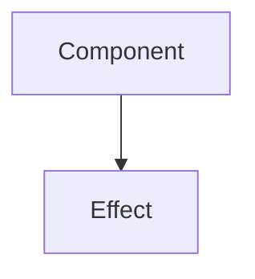

## Summary

<!-- What changed and why -->

## Changes

<!-- Bullet list of key changes -->

## Architecture

<!-- Mermaid diagram of affected components/data flow (delete if not applicable) -->

## Test Plan

- [ ] <!-- How to verify this works -->

## Checklist

- [ ] TypeScript passes (`cd web && pnpm tsc --noEmit`)
- [ ] Design system tokens used (no hardcoded hex)
- [ ] No secrets committed
